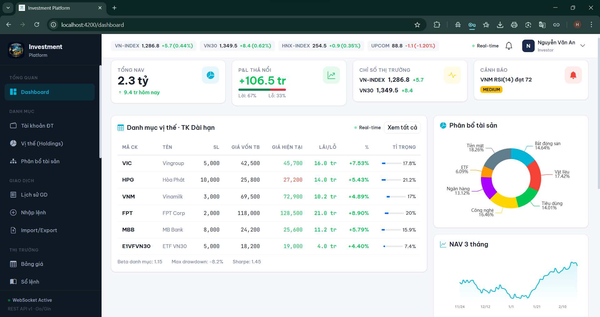
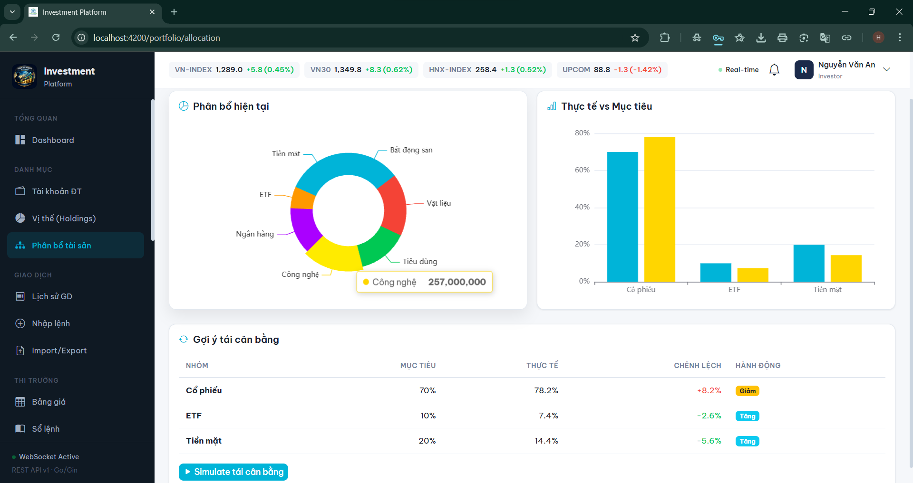
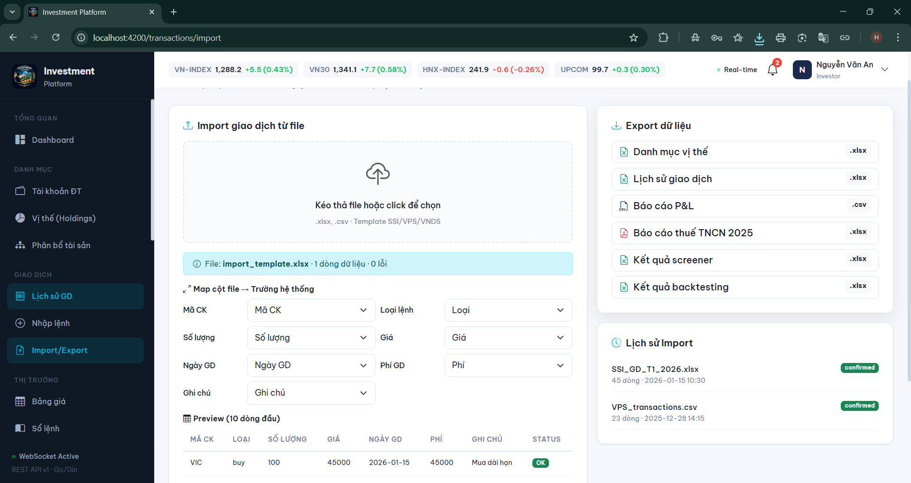
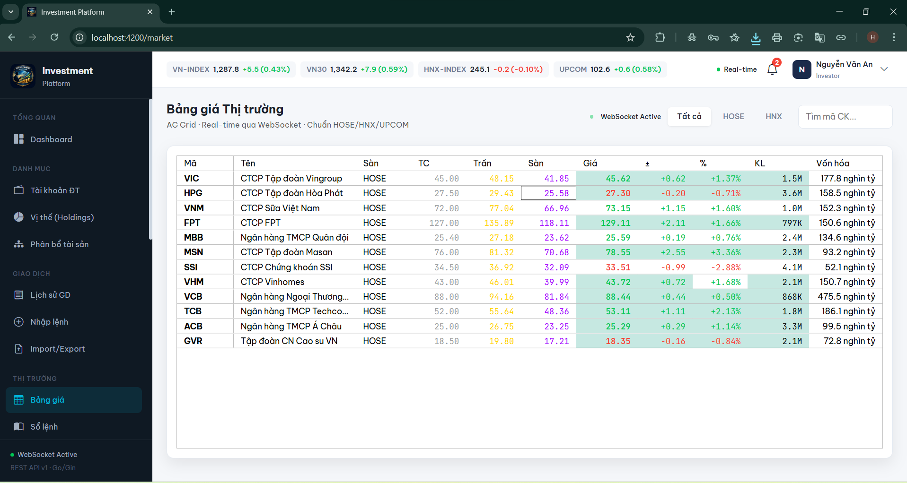
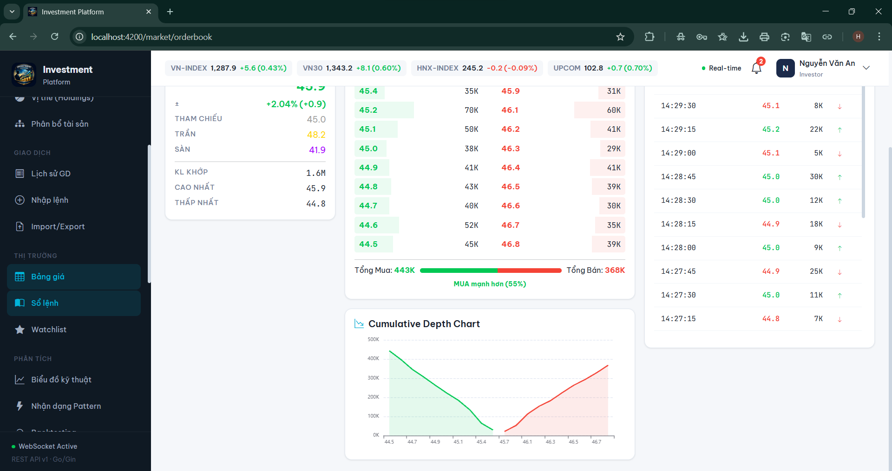
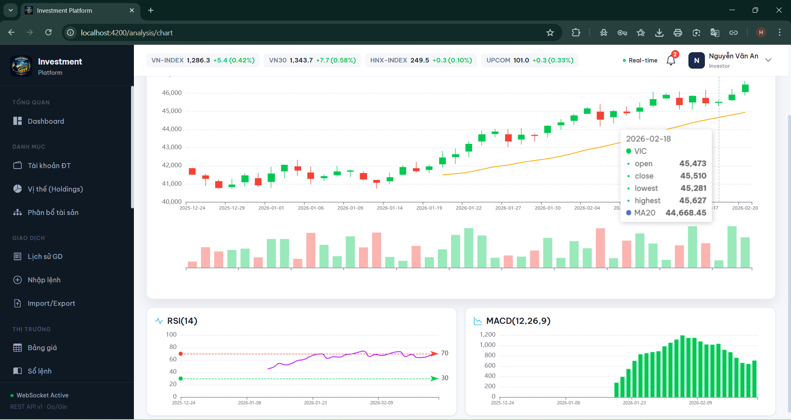
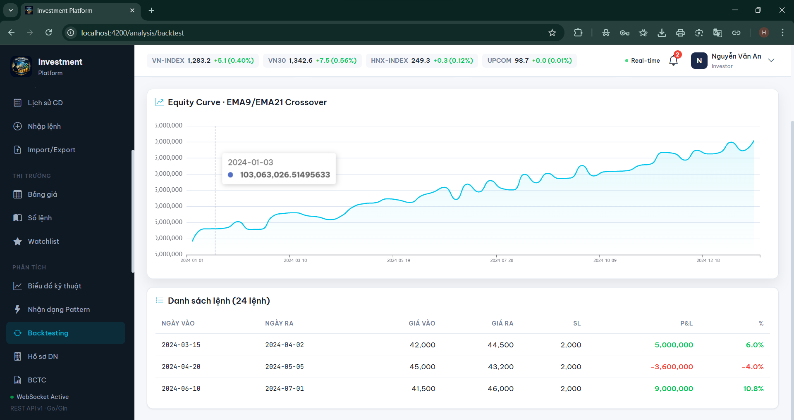
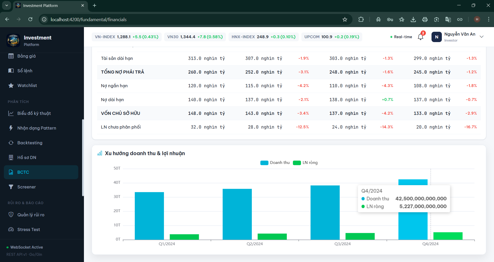
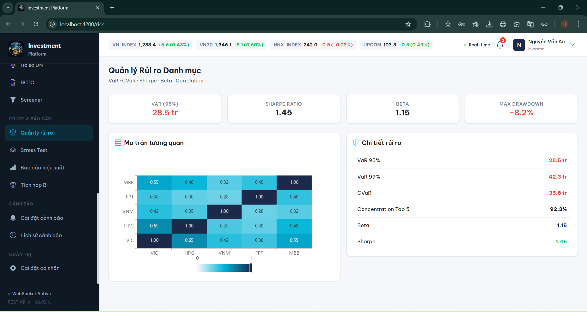

# Investment Platform

Nền tảng quản lý danh mục đầu tư chứng khoán Việt Nam — phục vụ 13 nghiệp vụ cốt lõi: Dashboard, Quản lý Danh mục, Giao dịch, Theo dõi Thị trường Realtime, Phân tích Kỹ thuật, Phân tích Cơ bản, Quản lý Rủi ro, Báo cáo & BI, Cảnh báo, Nhật ký, Xuất nhập Dữ liệu, Cấu hình Hệ thống, Quản trị Người dùng.











**Frontend** chạy độc lập bằng mock data, sẵn sàng kết nối **10 microservices** backend chỉ bằng 1 dòng config.

```
Tech Stack
├── Frontend:   Angular 17 · Bootstrap 5 · ng-bootstrap · NgRx Signal Store
│               Apache ECharts · AG Grid Community · SheetJS
│               angular-oauth2-oidc · Reactive Forms · RxJS · TypeScript · SCSS · Signals
└── Backend:    Go 1.22 · Gin · gRPC · Protobuf
                MariaDB 11 / IBM Db2 · Redis 7
                Tableau · Power BI · Cognos · Apache OpenOffice Base
                WebSocket · Docker · Kubernetes
```

---

## Tài liệu

```
READ FIRST/              Đọc trước khi làm bất cứ việc gì
├── architecture.md        Kiến trúc 10 microservices + 2 gateways, 6 quyết định thiết kế, sơ đồ giao tiếp
├── business-flows.md      10 luồng nghiệp vụ chính với sequence diagram chi tiết
└── rbac-matrix.md         3 lớp phân quyền: UI sidebar · API endpoint · data row/column

READ FRONTEND/           Dành cho frontend developer
├── frontend-structure.md  Cây file Angular 17, mapping TypeScript ↔ Go struct, 3 tài khoản demo
└── mock-data.md           9 cổ phiếu, 12 mã giá, 20 giao dịch, 3 TK đầu tư, seed data khớp backend

READ BACKEND/            Dành cho backend developer
├── backend-structure.md   10 microservices, ports REST + gRPC, package structure chuẩn Go
├── api-contracts.md       70+ endpoints REST, pagination, error format, auth header, WebSocket messages
├── database-schema.md     MariaDB DDL đầy đủ, 14 tables, constraints, indexes, naming conventions
└── grpc-contracts.md      4 proto files, 13 RPC methods, timeout, retry, circuit breaker config

READ DEPLOY/             Dành cho DevOps / người cài đặt
├── docker-compose.md      Toàn bộ hạ tầng 1 file: MariaDB + Redis + 10 services + 2 gateways
├── coding-conventions.md  Quy tắc code Go · Angular · Git, PR checklist
├── testing-troubleshooting.md  Pyramid 70/20/5/5, coverage targets, debug tools, symptom checklist
└── environment-windows.md Cài đặt toàn bộ 23 phần mềm trên Windows từ đầu
```

---

## Chạy nhanh (chỉ Frontend)

```bash
cd investment-frontend
npm install
ng serve
```

Mở http://localhost:4200 — đăng nhập bằng email và password tương ứng.

**3 tài khoản demo:**

| Email | Password | Role | Trang mặc định |
|---|---|---|---|
| `investor@investment.vn` | `123456` | Investor | Dashboard + Danh mục + Giao dịch |
| `analyst@investment.vn` | `analyst123` | Analyst | Thị trường + Phân tích + BI |
| `admin@investment.vn` | `admin123` | Admin | Dashboard + Quản trị hệ thống |

---

## Kết nối Backend

Frontend hiện dùng mock data nội bộ. Khi backend sẵn sàng, kết nối bằng cách:

### 1. Tắt mock mode

Mở `src/app/core/services/api.service.ts`, dòng 9:

```typescript
const USE_MOCK = false;   // đổi từ true → false
```

### 2. Cấu hình proxy

Tạo file `proxy.conf.json` ở root frontend:

```json
{
  "/api/v1": {
    "target": "http://localhost:8080",
    "secure": false,
    "changeOrigin": true
  }
}
```

Chạy với proxy:

```bash
ng serve --proxy-config proxy.conf.json
```

### 3. Cấu hình WebSocket

Mở `src/app/core/services/websocket.service.ts`, đổi endpoint:

```typescript
connect(endpoint: string = 'ws://localhost:8090/ws/market')
```

5 WebSocket channels:

```
ws://localhost:8090/ws/market              Giá cổ phiếu real-time
ws://localhost:8090/ws/portfolio           NAV, P&L danh mục
ws://localhost:8090/ws/orderbook/{symbol}  Sổ lệnh real-time
ws://localhost:8090/ws/alerts              Cảnh báo
ws://localhost:8090/ws/news                Tin tức thị trường
```

### 4. Khởi động backend

```bash
cd investment-backend

# Khởi động infrastructure
docker compose up -d mariadb redis

# Chạy migrations + seed data
./scripts/migrate.sh up
./scripts/seed.sh

# Khởi động tất cả services
docker compose up -d
```

10 services sẽ chạy trên các port:

```
api-gateway           :8080     ← Frontend gọi tới đây
realtime-gateway      :8090     ← WebSocket kết nối đây
auth-service          :8083
portfolio-service     :8081  (gRPC :9081)
market-data-service   :8082  (gRPC :9082)
analytics-service     :8084  (gRPC :9084)
risk-service          :8085
report-service        :8086
notification-service  :8087  (gRPC :9087)
config-service        :8088
```

### 5. Verify kết nối

```bash
# Test API Gateway
curl http://localhost:8080/api/v1/market/indices

# Test login
curl -X POST http://localhost:8080/api/v1/auth/login \
  -H "Content-Type: application/json" \
  -d '{"email":"investor@investment.vn","password":"123456"}'

# Test gRPC
grpcurl -plaintext localhost:9081 list
```

Mở http://localhost:4200 — toàn bộ dữ liệu sẽ lấy từ backend thật thay vì mock.

